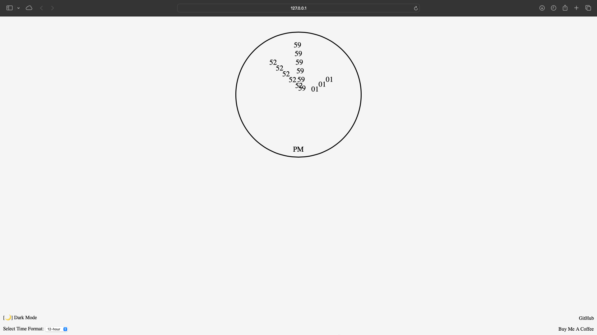
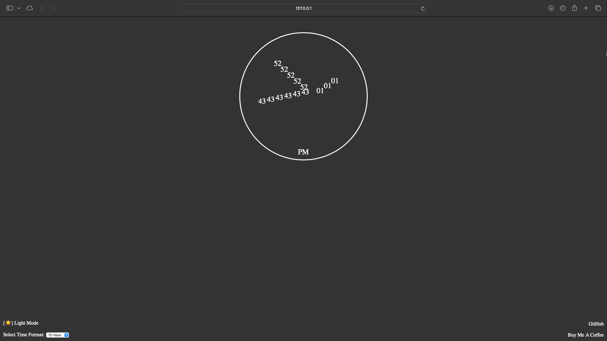

# Clock

## Description

The Clock is a simple web application that displays the current time with options to switch between 12-hour and 24-hour formats. It also includes a dark mode toggle and links for support and GitHub.

## Features

- **Current Time Display:** Shows the current time with hours, minutes, and seconds.
- **Time Format Selection:** Switch between 12-hour and 24-hour time formats.
- **Dark Mode:** Toggle between light and dark modes.

## Usage

1. **View Current Time:**
   - The current time is displayed and updated every second.

2. **Toggle Dark Mode:**
   - Click the "[🌙] Dark Mode" button to switch between light and dark modes.

3. **Change Time Format:**
   - Use the dropdown menu to select between 12-hour and 24-hour time formats.

4. **Support and GitHub Links:**
   - Click "Buy Me A Coffee" to support the developer.
   - Click "GitHub" to visit the repository.

## Screenshots

### Light Mode

### Dark Mode

## License

This project is licensed under the MIT License. See the LICENSE file for details.

## Support

If you find this project helpful, please consider supporting me on [Buy Me a Coffee](https://www.buymeacoffee.com/york0524).